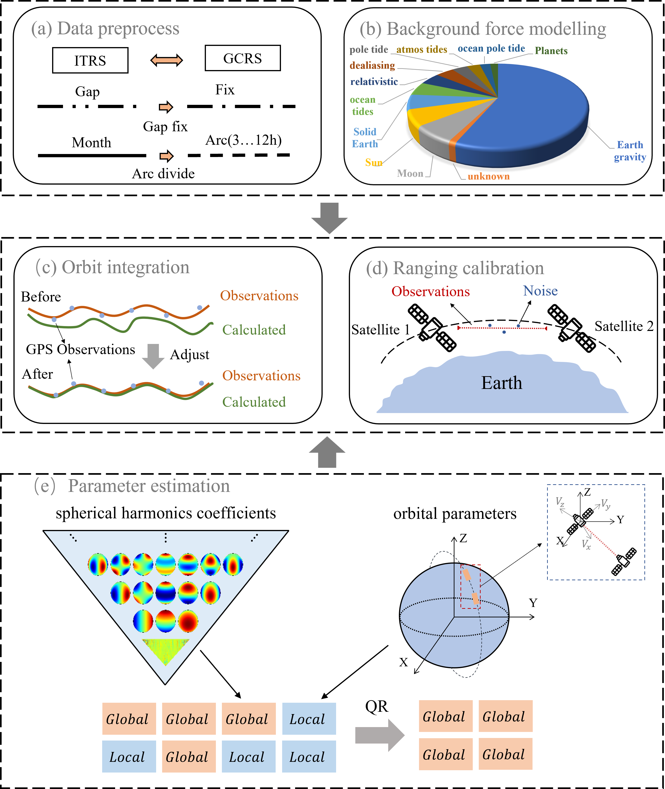

# PyHawk: An efficient gravity recovery solver for low-low satellite-to-satellite tracking gravity missions

# 1. Description
The low-low satellite-to-satellite tracking (ll-sst) gravity missions,such as the Gravity Recovery and Climate Experiment (GRACE) and its Follow-On (GRACE-FO), provide an important space-based Essential Climate Variable (ECV) over the last two decades. The measurement systems of these ll-sst missions are highly complex, thus, a data processing chain is required to exploit the potential of their high-precision measurements, which challenges both the general and expert users. In this study, we present an open-source, user-friendly, cross-platform and integrated toolbox "PyHawk", which is the first Python-based software in relevant field, to address the complete data processing chain of ll-sst missions including GRACE, GRACE-FO and likely the future gravity missions. This toolbox provides non-expert users an easy access to the payload data pre-processing, background force modeling, orbit integration, ranging calibration, as well as the ability for temporal gravity field recovery using ll-sst measurements. Researchers working with the low-Earth-orbit space geodetic techniques, GNSS based orbit determination, and gravity field modeling can benefit from this toolbox.

    

# 2. Contact

Yi Wu (wu_yi@hust.edu.cn) , Fan Yang (fany@plan.aau.dk)

# 3. Features
- It adopts advanced data exchange mechanisms, enabling users to interact with the software through configuration files, which eliminates the need to modify source code and reduces the risk or complexity associated with code changes.
- The software has been optimized to achieve computational efficiency comparable to that of Fortran and C++, languages commonly used in existing GRACE (-FO) toolboxes.
- PyHawk is compatible with multiple platforms and allows for easy and fast installation on systems such as Windows, Linux or clusters.
- PyHawk has a modular structure, where code is highly decoupled internally for an easy use, comprehension and extension.

# 4. Installation

Assuming that Conda is already configured, one can follow the steps to install the required dependencies (both work for Windows and Linux):
1. `conda create -n py-hawk python=3.8.10`
2. `source activate py-hawk` 
3. `pip install -r requirments.txt` 

**Troubleshooting:** PyHawk has a dependence on two essential dynamic libraries (C++), see 'PyHawk/lib'. For this, we have provided the pre-compiled dynamic libraries (created individually for Linux and Windows) to simplify the installation. However, these pre-built libraries may occasionally fail because of incompatibility between the libraries and running platform. If this is the case, we suggest you to use the provided C (C++) source code together with the compiling script (PyHawk/lib) to automatically compile a library compatible with your own platform: Open a terminal under PyHawk/lib, and execute the 'make' command. In this manner, it automatically generates a library of 'GravHar.so' if this is run at Linux platform; however, for Windows, you may need an extra software (Visual C++) to generate the 'GravHar.dll' library. For another important dependency 'sofa', please see the official website for its source code and cookbook (http://www.iausofa.org/). Please also feel free to reach out to us about any further issues. 

# 5. Sample data
Essential sample data for running the demos are provided that include (but not limited to):
- **GRACE-(FO) Level-1b data:** A few months data for demo. Suggested default path: /PyHawk/data.
- **De-aliasing product:** A few months data. Suggested default path: /PyHawk/data/AOD/RL06.
- **EOP:** Suggested default path: /PyHawk/data/eop.
- **Load Love Number:** Suggested default path: /PyHawk/data/LoveNumber.
- **Static Gravity:** Suggested default path: /PyHawk/data/StaticGravityField.
- **Ephemerids:** Suggested default path: /PyHawk/data/Ephemerides.
- **Auxiliary:** Suggested default path: /PyHawk/data/Auxiliary.
- **Benchmark:** Suggested default path: /PyHawk/data/Benchmark.

Be aware that these sample data are of large size, so that we put them at an open data repository (https://doi.org/10.5281/zenodo.14205243) for use when running the demos. After downloading the data file, simply place it in the /PyHawk/ path

# 6. Quick Start
Here we present three demo (demo1, demo2, demo3), which are available under /PyHawk/demo, to showcase the usage of PyHawk. For the sake of generality, we design three specific demos to cover the major interests of the users: (1) demo-1 for orbit determination (2) demo-2 for background force modeling and (3) for the gravity field modeling. Be aware that, since PyHawk is a comprehensive toolbox for various research objectives, it is unlikely to be exhaustive to list all operations here. Nevertheless, one can see the detailed description at the comments of each demo in its scripts.

To be able to run the demo, please be aware that sample data as addressed in previous section are required. And for a quick start, we suggest to put all these sample data at default path: /PyHawk/data/. Nevertheless, as an advanced user, one can place data at any desired place as long as the setting files are well configured. Here is a brief tutorial of three demos.

## 6.1 Demo-1
This demo is the basis of orbit determination. For the sake of computational efficiency, we will demonstrate the calculation of only one arc segment (6-hourly dataset). In this case, no parallelization is required so that the computation should be affordable for personal computer. The time for completing this demo is around 7 minutes, which may slightly varies with the platform.

Navigate to the /PyHawk/demo/, open a terminal and execute the command: `python demo_1.py`

## 6.2 Demo-2
This shows how to calculate each background force model and quickly generates benchmark test result as an illustration of the accuracy of the software. A complete process of this demo takes about 4 minutes.

Navigate to the /PyHawk/demo/, open a terminal and execute the command: `python demo_2.py`

## 6.3 Demo-3
This demonstrates the process of temporal gravity recovery, which is also the primary objective of the ll-sst missions such as GRACE, GRACE-FO and future satellite gravity missions. Figure \ref{fig-processing} illustrates how this demo is proceeding. Similarly, as an demonstration, we choose to recover the gravity from one arc (6-hourly data) rather than the one-month arc for gaining an efficiency. In this manner, parallelization is no longer required and computation should be affordable for personal computer. The completion time is estimated to be around 5 minutes.

Navigate to the /PyHawk/demo/, open a terminal and execute the command: `python demo_3.py`
